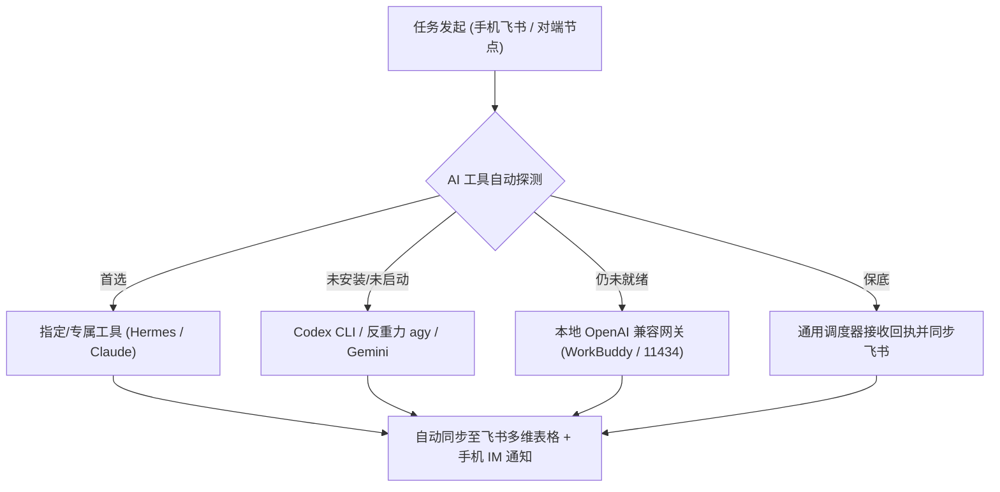

# 昆仑增长三机平权协同 · 全局共享记忆中枢 (Shared Memory Vault)

> **版本**：v1.0.0 · **更新时间**：2026-10-03 · **定位**：三机所有 AI 节点的共享认知与技术共识

---

## 🏛️ 三机节点架构与责任田分工

| 节点代码 | 物理机定位 | 核心角色与职能 | 专属 GitHub 分支 | 飞书文档 ID | 默认 AI 工具池 |
| :--- | :--- | :--- | :--- | :--- | :--- |
| **`mac`** | Mac 决策总机 | **架构师 / CTO / 决策总脑** • 需求拆解与工单分配 • 架构设计方案审查 • PR 合流裁决 | `work/mac-hermes` | `DvthdyGtuomOBuxeWXscbNGlnqf` | Hermes Agent (:8642), Claude Code, Codex |
| **`aimarshalllee`** | Windows 业务主机 | **主力研发攻坚 (Tech Lead)** • 业务代码编写与重构 • 大工程编译与打包 • 本地环境调试 | `work/win-dev` | `Nj31dducHoRFXBxZfHvce5yQnEh` | Codex CLI, Claude, Workbuddy, 本地环境 |
| **`xixi`** | Windows 验证备机 | **独立 QA / 质检验收把关人** • 干净机独立复验与安装 • 构建产物 SHA-256 核验 • 飞书资产池归档与报表 | `work/xixi-verify` | `QOYmdeRh4o8aSuxClkucSbqznVf` | 谷歌反重力 (agy), Codex, 自动化脚本 |

---

## 🔄 多通道动态调度机制 (Dynamic Routing)

系统支持以下 **4 重通道与自适应降级调度**，绝不因单一工具未安装而卡死：

1. **毫秒级即时门铃**：MQTT 私有总线（阿里云杭州集群，50ms 唤醒）。
2. **结构化任务中枢**：飞书多维表格 [三机协同任务流水](https://acnxzk6f4wv6.feishu.cn/wiki/I6WUwdLbFi3fHUkCOIXcsFYmnWK)。
3. **隔离代码流转**：GitHub 3 专属分支，彼此独立提交，无代码冲突。
4. **掌上实时直推**：飞书官方通道直推手机，随时查看结果。

---

## 📌 当前全局活跃共识 (Active Consensus)

1. **分支合流规范**：日常开发一律提交至各自的 `work/*` 分支；每周或里程碑完成时，由 Mac (Hermes) 或西溪机发起向 `kunlun-bus-sync` 或 `main` 的 Pull Request。
2. **零凭据输出**：严禁在飞书文档、Git Commit、日志或终端输出任何 Token、密码、私钥或 Secret。
3. **断网容灾**：若 MQTT 短暂离线，任何机器均可通过轮询飞书多维表格获取 PENDING 工单，网络恢复后自动补发回执。
4. **咔哒商业交付基准 (来自 Mac 实测经验)**：
   - 单条接待时延必须压缩至 30s 以内，杜绝高频截屏识图（采用像素坐标缓存）。
   - 输入框判空稳定性必须通过操作系统底层辅助功能 (UI Automation) 双向读回校验。
   - 商业化交付底线：零环境门槛绿色安装（坚决杜绝“只有开发者自己能跑”）。
   - 当前分工：Mac (Hermes) 负责架构评审与缺陷分析，AiMarshallLee 负责代码重构构建，西溪机完全免测解耦。
